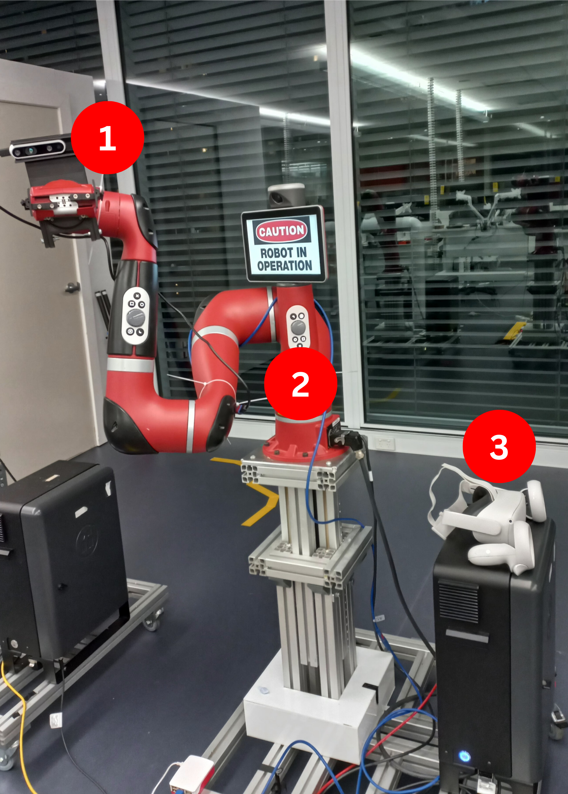
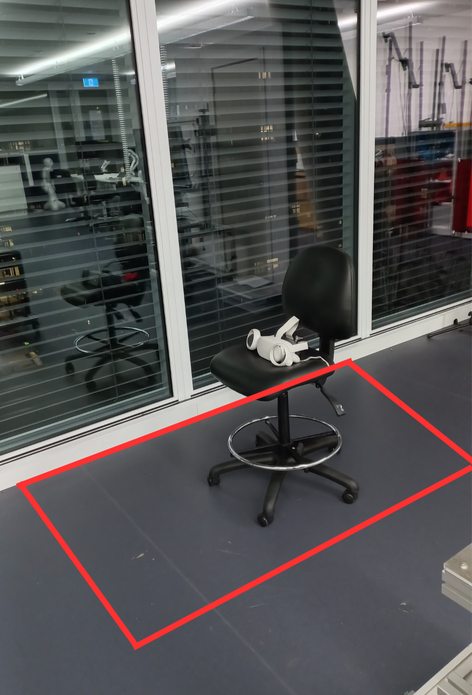
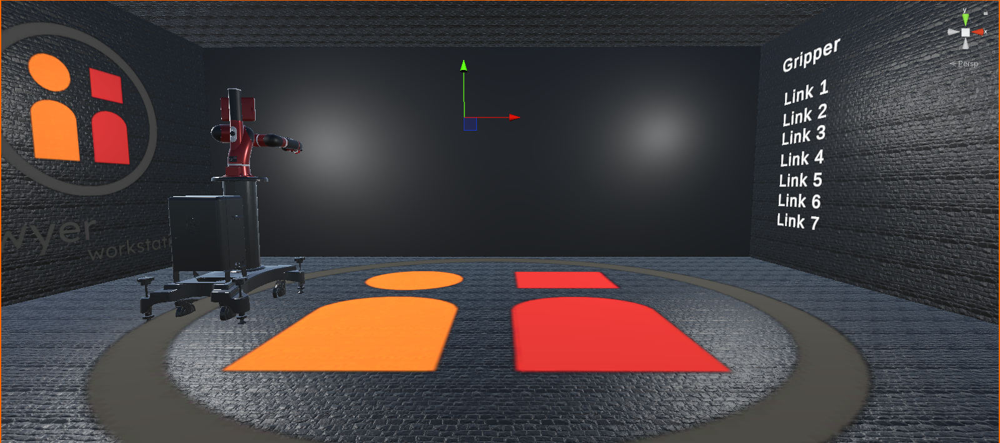
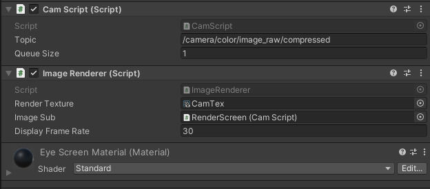
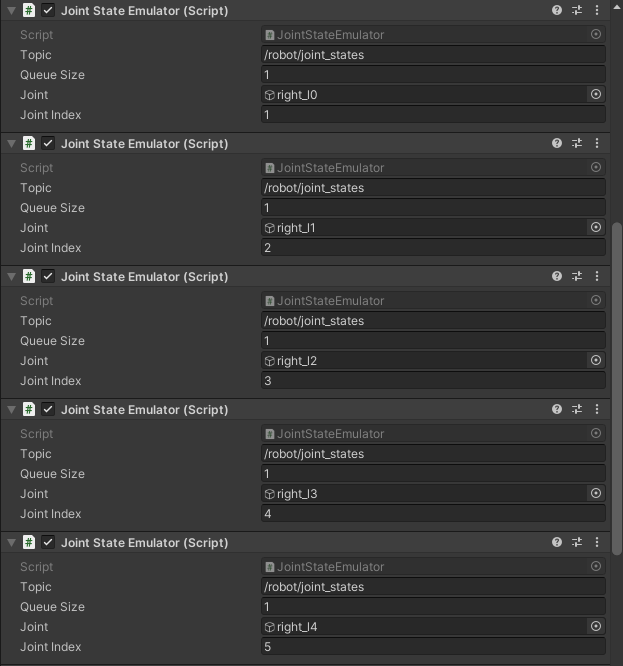

# OpenXR: Eye-in-Hand Sawyer Teleoperation 

---

## Required Packages

#### ROS
[ROS-TCP-Endpoint](https://github.com/Unity-Technologies/ROS-TCP-Endpoint) - ROS package used to create an endpoint to accept ROS messages sent from a Unity scene using the ROS TCP Connector scripts.
[intera_common](https://github.com/RethinkRobotics/intera_common) - ROS Messages and tools description files for Rethink Robotics robots.    
[intera_sdk](https://github.com/RethinkRobotics/intera_sdk) - Software Development Kit and Interface for Rethink Robotics robots.  
[sawyer_robot](https://github.com/RethinkRobotics/sawyer_robot) - Sawyer-specific components for the Sawyer robot for use with the [`intera_sdk`](https://github.com/RethinkRobotics/intera_sdk).  
[sns_ik](https://github.com/RethinkRobotics-opensource/sns_ik) - Saturation in the Null Space (SNS) Inverse Kinematic Library.  
[realsense2_camera](https://github.com/IntelRealSense/realsense-ros/tree/ros2-development/realsense2_camera) (optional) - Intel(R) RealSense(TM) ROS Wrapper for Depth Camera. Use whatever package that is compatible with the specific camera being used.

#### Unity
[ROS-TCP-Connector](https://github.com/Unity-Technologies/ROS-TCP-Connector) - Unity package to set the communication from Unity to ROS or vice-versa for manipulating ROS Messages.     
[URDF-Importer](https://github.com/Unity-Technologies/URDF-Importer) - Unity package that allows you to import a robot defined in URDF format in a Unity scene.     
[OpenXR Plugin](https://docs.unity3d.com/Packages/com.unity.xr.openxr@1.6/manual/index.html) - Standard developed by Khronos that aims to simplify AR/VR development.

To use the real Sawyer, the ROS workstation can be setup with the following [instructions](https://support.rethinkrobotics.com/support/solutions/articles/80000980134-workstation-setup).

## Summary
This package is used to apply task-space velocity dynamics with virtual-reality inputs from a [Oculus Quest 2](https://www.meta.com/au/quest/products/quest-2/?utm_source=www.google.com&utm_medium=oculusredirect) to teleoperate Rethink Robotic's Sawyer to follow a specified trajectory.

Launch files in this package are set up such that one can utilise Unity's XR Library to augment VR functionalities and remotely control a real robot in real-time.

The underlying concepts behind this velocity control approach are primarily referenced from the [sawyer_velctrlsim](https://github.com/michaeltobia/sawyer_velctrlsim) package, along with the teleoperation extension detailed in my [portfolio](https://portfolium.com.au/project/draft/70958).

## Instructions For Use:
Ideally you want to have two separate devices: one Linux device running the `ROS` functionalities which entail the Sawyer's control, and another Windows running `Unity` augmenting the virtual-reality capabilities. Running these simultaneously in a virtual machine is also possible, but I would heavily recommend having a separate device for each to prevent delays and optimise performance.

**<u>Key</u>**: Windows **[W]**, Linux **[L]**

1. Install [Unity Hub](https://unity.com/download) (at least version `2021.3.21f1`) with a Unity account. **[W]**
2. Clone the repository using [git](https://git-scm.com/download/linux) or download this project as a zip file. Extract the `ROS` folder to your ROS (or catkin) workspace, and the `Unity` folder to the directory with your Unity projects. **[W]** **[L]**
3. Add the project from your Unity projects' directory in Unity Hub, by selecting `Add Project from Disk` from the drop-down menu and navigating to the extracted files. Open the project. **[W]**
4. Follow all of the instructions [here](https://developer.oculus.com/documentation/unity/unity-gs-overview/) to setup Unity with the Oculus and enable developer mode on the Meta Quest 2. **[W]**
5. The Meta Quest can be run using [Air Link](https://www.meta.com/en-gb/help/quest/articles/headsets-and-accessories/oculus-link/connect-with-air-link/) or [Quest Link](https://www.meta.com/en-gb/help/quest/articles/headsets-and-accessories/oculus-link/connect-link-with-quest-2/). The latter is recommended using The Link cable, unless you have a good Wi-Fi connection to use Air Link. **[W]**
6. Set up the [Guardian Boundary](https://www.youtube.com/watch?v=GojevL05Avw) of the Meta Quest to match closely to the working envelope of the robot. Ensure that the base height of the boundary is level with Sawyer's base. **[W]**

7. In `Robotics` -> `ROS Settings`, set the ROS IP Address to match that from your Linux device and the ROS Port to any value you wish to set your connection. To check the IP on Linux, run `hostname -I` in your Terminal. **[W]**
8. On the ROS side, make sure that everything is configured within the intera workspace previously set up (accessed by running `./intera.sh` within the corresponding ROS workspace). First, configure the ROS TCP endpoint package by running `roslaunch ros_tcp_endpoint endpoint.launch tcp_ip:=your_ip tcp_port:=your_port`. **[L]**
9. With the VR set up, launch [Quest Link](https://www.meta.com/help/quest/articles/headsets-and-accessories/oculus-link/connect-link-with-quest-2/) and run the Unity game to establish the TCP connection and communicate the VR data as ROS Messages. **[W]**

10. Run the main [launch](https://github.com/paulonhantumbojr/sawyer_vr_teleop/blob/master/launch/vel_ctrl.launch) file and set the corresponding mode to your setup, either `sim` or `vr`. The full declaration is `roslaunch sawyer_vr_teleop vel_ctrl.launch mode:=[mode here]`. The function of these modes is described in [package details](#Package-Details). **[L]**
11. Set up your dedicated camera sensor in `ROS` and ensure that its corresponding topic is instantiated in the Unity element that displays the image textures. **[W]**

**Note:** To ensure that the robot state in Unity matches with the one in testing (depending on the mode), you will have to manually declare the topics inside the `JointEmulator.cs`. **[W]**

## Package Details
### Launch Files

#### `vel_ctrl.launch`

* This launch file contains the launch parameters for disctinct teleoperation modes with the Rethink Robotics Sawyer. One where a simulation of the robot is set up solely in the Rviz (`sim`), another where a real robot is controlled by the virtual-reality controller manipulators (`vr`). The latter is set up in tandem with the simulator separately as a predefined configuration of a simulation tends to mess with the RobotModel of Sawyer when instantiated multiple times. The primary difference between these is found within `traj_gen_sim.py` and `traj_gen_vr.py` where the trajectory for the robot to follow is published. The trajectory is generated as a `TransformStamped` message published on the `/desired_trajectory` by the `/ref_trajectory_[mode]` nodes.

##### `sim`
* `sim_vel_ctrl.py` calculates the joint velocities necessary to drive the simulated end effector to the most recent message published on topic `/desired_trajectory`. It then publishes these commands as a `intera_core_msgs/JointCommand` message on the `/robot/limb/right/joint_command` topic. This is the same topic and message type used on Sawyer in real world use.

* The simulated nature of this process means we have to calculate Sawyer's joint states from the velocity commands, since there is no real Sawyer to retrieve the joint states from. This is handled by the `vel_ctrl_sim_interface` node. Found in `vel_ctrl_sim_interface.py`, this node unpacks the `intera_core_msgs/JointCommand` message found on the `/robot/limb/right/joint_command` topic. It then interpolates the simulated Sawyer's joint positions and publishes them on the `/joint_states` topic. This is the `/joint_states` topic that the `robot_state_publisher` subscribes to for `tf` calculations.

* The end result of running this launch file is an RViz instance where a simulated Sawyer can be seen following the trajectory specified in `traj_gen_sim.py`.

##### `vr`
* Combined non-simulation and simulation mode that drives the real-world  Sawyer's end effector to the trajectory specified by the VR headset controller in `traj_gen_vr.py`. An additional functionality is embedded to control the parallel gripper.

* A fair amount of cautious respect should be given when running Sawyer in velocity control mode. The velocity limits on Sawyer's joints are surprisingly high and can cause damage or injury if this launch file is used with out some level of care. To prevent damage, joint velocity commands can be limited in `sawyer_vel_ctrl.py` [here](https://github.com/michaeltobia/sawyer_velctrlsim/blob/0ab7adfe4be4a372230d1d4fa44a1a1a1e5e1849/src/sawyer_vel_ctrl.py#L108-L111). Joint speed can also be limited by reducing the proportional control coefficient `self.Kp` in `sawyer_vel_ctrl.py`. This is not a direct limit, but it will reduce the aggression of the controller resulting in slower trajectory tracking. More information about Sawyer's joint control modes can be found on the Intera SDK site [here](http://sdk.rethinkrobotics.com/intera/Arm_Control_Systems#Joint_Control_Modes).

* This mode runs three nodes:
 1. **`sawyer_vel_ctrl`**: Control loop. Takes drives Sawyer's end effector to the most recently received `TransformStamped` message published on the `/desired_trajectory` topic. This node stores Sawyer's joint states every time it is published over the `/robot joint_states` message. Forward kinematics is then used to calculate the current end effector position. Finally, a velocity command is calculated from the error between the current end effector position and the desired end effector position. This velocity command is send as a `intera_core_msgs/JointCommand` over the `/robot/limb/right/joint_command` topic. These commands are then processed by Saywer's internal `realtime_loop` to send velocity commands to Sawyer's joints.

 2. **`ref_trajectory_vr`**: Desired trajectory generator. Generates `TransformStamped` messages according to the specified task-space trajectory in `traj_gen.py` and publishes them to the `/desired_trajectory` topic. 

 3. **`sdk_gripper_vr`**: Gripper Control. Takes input from the Quest 2 controllers and controls the opening, closing, calibrating, and stopping functionalities of the electric parallel gripper mounted at Sawyer's end-effector. It allows the control of the gripper for picking applications while the arm is simultaneously being controller to generate trajectories.

* A demonstration video is showcased [here](). That said, running this launch file while connected to Sawyer will cause Sawyer to follow the trajectory specified in `traj_gen.py` approximately"exactly  the same way it does in `sim_vel_ctrl.launch`.

### Script File Details

#### `gripper_ctrl.py`
* Used by `vel_ctrl.launch`.
* Maps the functionality of the electric parallel gripper to the Oculus controllers.

#### `modern_robotics.py`
* Used by in `sim_vel_ctrl.py` and `sawyer_vel_ctrl.py` for algebraic manipulation.
* Library for Modern Robotics by Dr. Kevin Lynch.

#### `sawyer_MR_description.py`
* Used in `sim_vel_ctrl.py` and `sawyer_vel_ctrl.py` for control calculations.
* Sawyer's kinematic description in a format that the Modern Robotics library in `modern_robotics.py` can understand.

#### `sawyer_vel_ctrl.py`
* Used in the real world control launch file `vel_ctrl.launch` for the `vr` mode.
* As mentioned before, joint velocity command limit can be changed [here](https://github.com/michaeltobia/sawyer_velctrlsim/blob/master/src/sawyer_vel_ctrl.py#L108-L111), though I would **not** recommend setting it much higher than **0.6** rad/sec. The control gains can further be adjusted to limit the motion of the manipulator in the code [here](https://github.com/michaeltobia/sawyer_velctrlsim/blob/master/src/sawyer_vel_ctrl.py#L39-L41). The value gains can be tweaked 
* Quick note: intera_core_msgs types are picky. Make sure you're using python standard data types (eg `int()`) and **not** ROS std_msgs message types (eg `Int32()`,`Float64()`, ect.) when passing data to intera messages.

#### `sim_vel_ctrl.py`
* Used in the simulated control launch file `vel_ctrl.launch` for the `sim` mode.
* Similar to `sawyer_vel_ctrl.py` besides the order of the `/joint_states` order.

#### `traj_gen_sim.py`
* Used in `vel_ctrl.launch` for the `sim` mode.  
* Publishes the desired trajectory for the simulated version of the velocity controller.
* Desired trajectory frame position and rotation can be freely specified in time
 * relative to Sawyer's base frame
 * x_d, y_d, and z_d specify desired position
 * [theta](https://github.com/michaeltobia/sawyer_velctrlsim/blob/ab5f22de727a5c1a07d79cf15d9931acbb78e38b/src/traj_gen.py#L39) specifies the desired rotation magnitude
 * The coefficients in [`q1_d`, `q2_d`, `q3_d`](https://github.com/michaeltobia/sawyer_velctrlsim/blob/master/src/traj_gen.py#L41-L43) specify the base axes to rotate about.
 * Rotation quaternion can also just be hardcoded in under [`Q_d`](https://github.com/michaeltobia/sawyer_velctrlsim/blob/ab5f22de727a5c1a07d79cf15d9931acbb78e38b/src/traj_gen.py#L44).

#### `traj_gen_vr.py`
* Used in `vel_ctrl.launch` for the `vr` mode. 
* Publishes the desired trajectory for the teleoperated version of the velocity controller.
* Desired trajectory frame position and rotation is specified by the pose of the VR headset collected from the correspondent XR Rig component.

#### `vel_ctrl_sim_interface.py`
* Used by `vel_ctrl.launch` for the `sim` mode.
* Interpolates and publishes a simulated Sawyer's joints positions based on the joint velocity commands from `sim_vel_ctrl.py`.

#### `viz_markers.py`
* Used by `traj_gen.py`.
* Creates a marker array for trajectory visualisation within the RViz simulator.